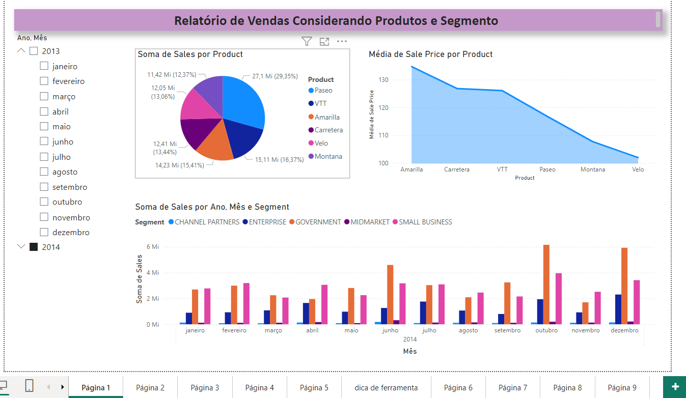

# Financial Dashboard - Power BI

## Descrição do Projeto

Este projeto é um dashboard financeiro desenvolvido no Power BI, projetado para fornecer uma visão abrangente sobre as finanças da empresa. O dashboard inclui várias visualizações e relatórios que ajudam a analisar e monitorar diferentes aspectos financeiros, como receitas, despesas, lucros, fluxo de caixa e outras métricas-chave.

## Arquivo

- **Nome do Arquivo:** sample_financial.pbix
- **Formato:** Power BI Desktop File (.pbix)

## Requisitos

Para visualizar e interagir com o dashboard, você precisará do [Microsoft Power BI Desktop](https://powerbi.microsoft.com/desktop/). Certifique-se de que está usando a versão mais recente do software para evitar problemas de compatibilidade.

## Imagem do Projeto

## Conteúdo do Dashboard

O dashboard contém as seguintes seções:

1. **Resumo Financeiro:** Uma visão geral dos principais indicadores financeiros, incluindo receitas, despesas e lucro líquido.
2. **Receitas por Categoria:** Análise detalhada das receitas segmentadas por diferentes categorias de produtos ou serviços.
3. **Despesas por Categoria:** Visualização das despesas divididas por diferentes categorias de custos.
4. **Fluxo de Caixa:** Monitoramento do fluxo de caixa da empresa ao longo do tempo.
5. **Análise de Tendências:** Gráficos e tabelas que mostram tendências e padrões financeiros.
6. **Comparações Temporais:** Comparação de desempenho financeiro em diferentes períodos.

## Como Usar

1. **Download do Arquivo:** Baixe o arquivo `sample_financial.pbix` para o seu computador.
2. **Abrir no Power BI Desktop:** Abra o Microsoft Power BI Desktop e carregue o arquivo baixado.
3. **Interagir com o Dashboard:** Explore as diferentes visualizações e relatórios. Utilize filtros e segmentações para analisar dados específicos.

## Personalização

Se você precisar personalizar o dashboard para atender às necessidades específicas da sua empresa, siga estas etapas:

1. **Modificar Consultas:** Acesse a visualização de dados para modificar as consultas e adaptar os dados.
2. **Alterar Visualizações:** Adapte as visualizações existentes ou adicione novas visualizações conforme necessário.
3. **Atualizar Dados:** Substitua as fontes de dados ou atualize os dados conforme necessário.

## Licença

Este projeto está licenciado sob a Licença MIT - veja o arquivo LICENSE.md para mais detalhes.
